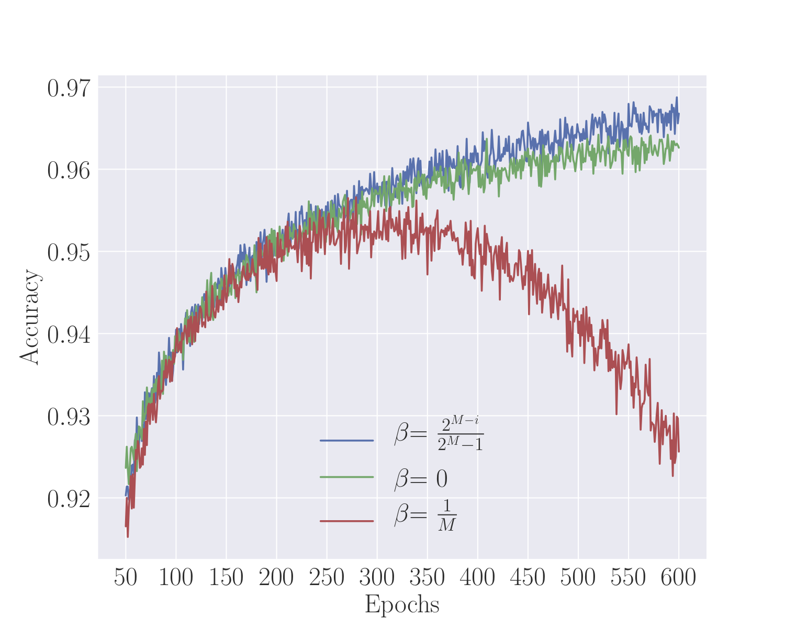
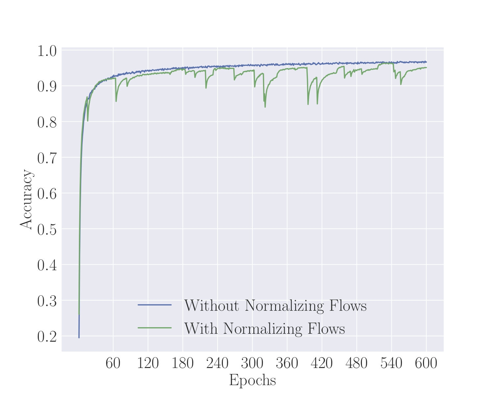
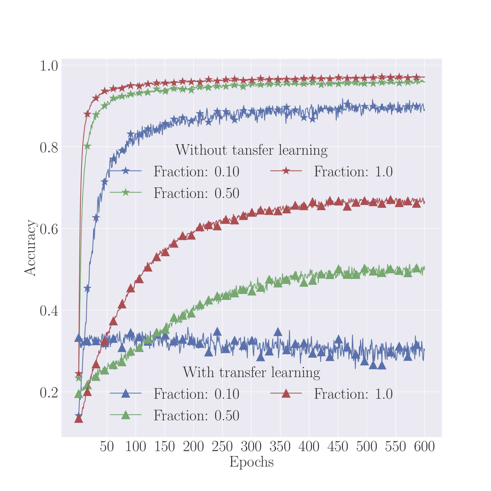

# Bayesian deep transfer learning

This repository implements Bayes by Backprop [(Blundell 2015)](https://arxiv.org/abs/1505.05424)
in **PyTorch** along with some neat methods to increase classifier performance. The goal of this
project is to understand how learning a posterior distribution
over some task can help in transfering to a new domain by using
the learnt posterior as a prior. We have therefore created a model for Bayesian transfer learning.

## Implemented methods

* Bayes by Backprop MLP [(Blundell 2015)](https://arxiv.org/abs/1505.05424)
* Normalizing flows [(Rezende 2015)](https://arxiv.org/abs/1505.05770)

## How to run an experiment

Make sure that you have Sacred installed `pip install sacred`. Then you would
be able to run any experiment by running:

```
python experiment.py with "${experiment_name}"
```

After running it will generate a log file and a set of weights in the folder `results/${experiment_name}`.

### Recreating Blundell

For example if you want to recreate the Bayes-By-Backprop paper by Blundell, you will need to run.

```
python experiment.py with "blundell"
```

In the plot below shows the accuracy over each epoch for different schemes for beta.



### Normalizing flows

To perform the same experiment as above, but with 16 normalizing flows, you can run the experiment as:

```
python experiment.py with "blundell" "num_flows=16" "experiment_name=results/normflow"
```

This will allow the training to converge much faster in accuracy, but at the cost of additional computation of flows.



### Transfer learning

Finally, to perform Bayesian transfer learning, you will need to train one model on one subset of the data A and then use the learned posterior over weights as a prior for learning on data B.

We have made convenient experiments to make this work. First run:

```
python experiment.py with "domain_a"
```

to train on A, then run:

```
python experiment.py with "transfer"
```

to transfer to the second domain. In general this does not good performance as evidenced by the plot below.



## Acknowledgement

This project was created by:

* [Andreas Munk](https://github.com/ammunk)
* [Jesper Wohlert](https://github.com/wohlert)
* [Felix Laumann](https://github.com/felix-laumann)
* Sayantan Sengupta

Under the supervision of

* [Casper Sønderby](https://github.com/casperkaae)